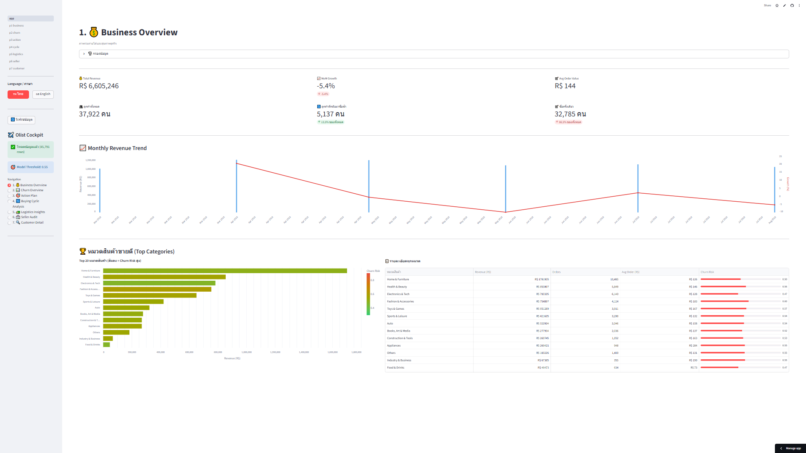
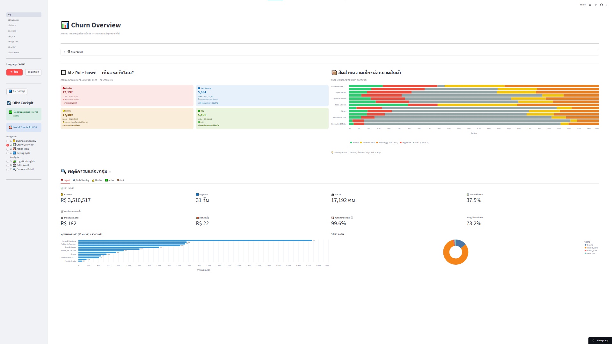
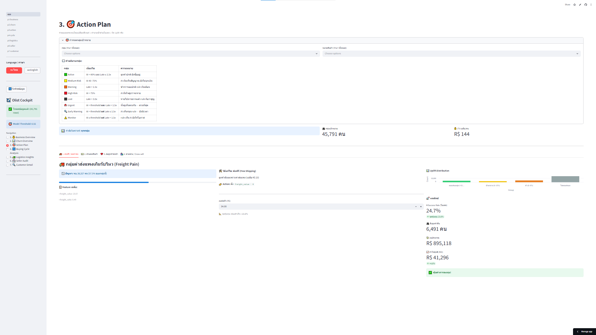
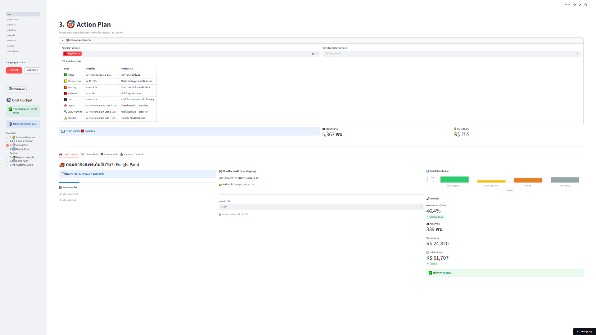
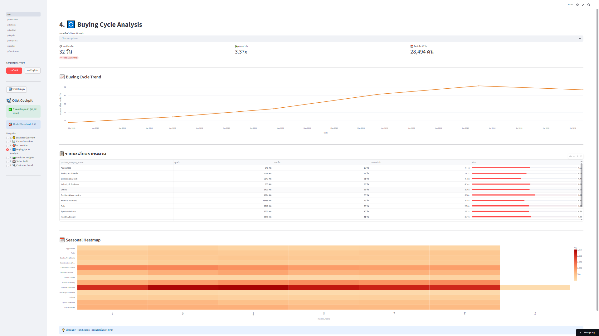
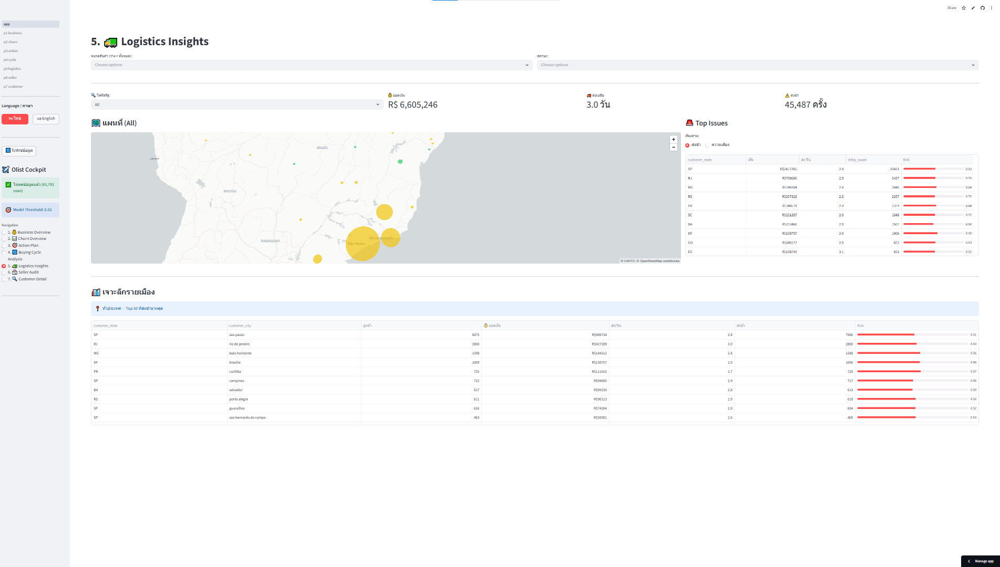
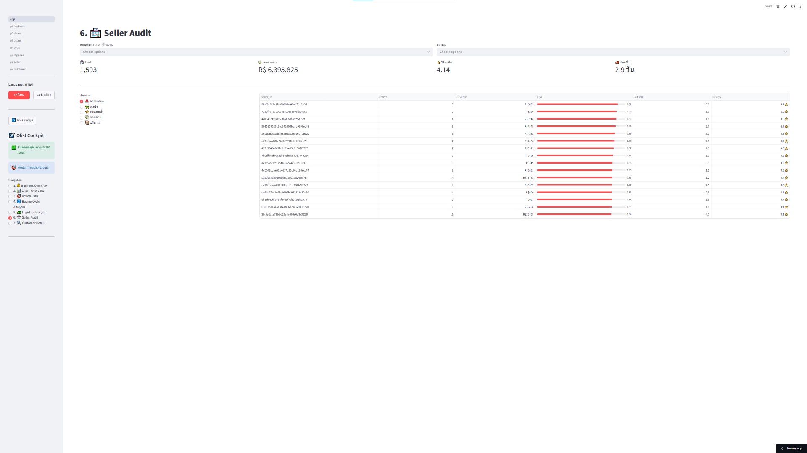

# 📊 Dashboard Guide — Olist Churn Intelligence Platform

> **Stack:** Python · FLAML AutoML · LightGBM · Streamlit Cloud · Google BigQuery
> **Model:** LightGBM · Macro F1 = 0.6784 · Threshold = 0.55

---

## 🗺️ Flow การใช้งาน

```
1. 💰 Business Overview  →  ดูภาพรวมรายได้ + หมวดสินค้า
          ↓
2. 📊 Churn Overview     →  เข้าใจกลุ่มเสี่ยง เลือก segment
          ↓
3. 🎯 Action Plan        →  จำลอง campaign + คำนวณ ROI
          ↓
4. 🔄 Buying Cycle       →  วิเคราะห์พฤติกรรมซื้อซ้ำรายหมวด
          ↓
5. 🚛 Logistics          →  วิเคราะห์ปัญหาส่งของรายรัฐ
          ↓
6. 🏪 Seller Audit       →  ตรวจ vendor ที่ทำให้ลูกค้าหนี
          ↓
7. 🔍 Customer Detail    →  ดูลูกค้ารายคน → ส่งต่อ Sales / CRM
```

---

## 📋 สารบัญ

| # | หน้า | ฝ่ายที่ใช้ได้ |
|---|------|-------------|
| [1](#1--business-overview) | 💰 Business Overview | CEO · Finance · Marketing |
| [2](#2--churn-overview) | 📊 Churn Overview | Marketing · CRM · Data Team |
| [3](#3--action-plan--roi-simulator) | 🎯 Action Plan | Marketing · CRM · Finance |
| [4](#4--buying-cycle-analysis) | 🔄 Buying Cycle | Marketing · Product · Inventory |
| [5](#5--logistics-insights) | 🚛 Logistics | Operations · Logistics |
| [6](#6--seller-audit) | 🏪 Seller Audit | Operations · Procurement |
| [7](#7--customer-detail--crm-roadmap) | 🔍 Customer Detail | Sales · CRM |

---

## 1 · 💰 Business Overview

### 📐 Layout Guide

> 📸 `docs/images/p1_layout.png`
> *(ไฟล์ที่มีแล้ว: `e368254f-cdd3-468e-9926-4e2bcee70d06.png`)*


### 📸 Dashboard จริง

> 📸 `docs/images/p1_dashboard.png` *(ถ่าย screenshot จาก Streamlit)*



### ส่วนประกอบหลัก

| ส่วน | คืออะไร |
|------|---------|
| **KPI Summary** | Total Revenue · MoM Growth % · Avg Order Value |
| **Monthly Revenue Trend** | Bar = ยอดรายเดือน · Line = % Growth MoM (แกนขวา) |
| **Top Categories Chart** | Top 20 หมวดสินค้า สีแท่ง = Churn Risk (เขียว→แดง) |
| **Category Table** | Revenue · Orders · Avg Order · Churn Risk ต่อหมวด |

### 💡 Insights และประโยชน์ต่อธุรกิจ

| Insight | ตัวอย่างจากข้อมูล Olist | Action |
|---------|------------------------|--------|
| MoM Growth ติดลบ = เดือนขาลง | Dec 2018 – Jan 2019 รายได้ลด | เตรียม campaign ล่วงหน้าก่อนช่วง low season |
| หมวดยอดสูง แต่ Churn Risk สูงด้วย | Health & Beauty — Risk = 0.56 | ออก loyalty program เฉพาะหมวดนี้ |
| Avg Order ต่างกันมากต่อหมวด | Fashion Avg = R$183 vs Food = R$73 | เสนอ bundle / upsell เฉพาะ high-AOV category |

### 🏢 ฝ่ายที่ได้ประโยชน์

| ฝ่าย | ใช้ทำอะไร |
|------|----------|
| CEO / Management | ดู revenue trend และ growth rate รายเดือน |
| Finance | ใช้ total revenue เป็น baseline วาง budget |
| Marketing | เลือกหมวดที่จะ push campaign จาก Churn Risk overlay |

---

## 2 · 📊 Churn Overview

> **หน้านี้ออกแบบใหม่** — เพิ่ม 2×2 AI×Rule Matrix และ
> Per-group Behaviour Analysis เพื่อให้เห็นภาพรวมก่อนไปหน้า Action Plan

### 📐 Layout Guide

> 📸 `docs/images/p2_layout.png`
> *(ไฟล์มีแล้วแต่ยังไม่ได้ upload — ใส่ไฟล์ annotated ของ p2 ที่นี่)*


### 📸 Dashboard จริง

> 📸 `docs/images/p2_dashboard.png` *(ถ่าย screenshot จาก Streamlit)*



### ส่วนประกอบหลัก

#### ① Filter — 2 วิธีกรอง

หน้านี้กรองได้ 2 วิธีและใช้คู่กันได้:

| วิธี | ตัวเลือก | ใช้เมื่อ |
|-----|---------|---------|
| **กรองตาม Status** (เดิม) | Active / Medium / Warning / High / Lost | อยากดู segment ตาม rule-based |
| **กรองตาม Matrix Group** (ใหม่) | Urgent / Early Warning / Monitor / Active | อยากดูตามผลเปรียบ AI vs Rule |

---

#### ② 2×2 AI × Rule-based Matrix

```
                   AI บอกว่า CHURN      AI บอกว่า SAFE
                ┌────────────────────┬──────────────────────┐
Rule: LATE      │  🚨 URGENT          │  ⚠️ MONITOR           │
(lateness>1.5x) │  ทั้งคู่เห็นตรงกัน │  Rule เห็น           │
                │  → ทำ campaign ทันที│  AI ยังให้โอกาส     │
                ├────────────────────┼──────────────────────┤
Rule: OK        │  🔍 EARLY WARNING   │  ✅ ACTIVE             │
(ในรอบปกติ)     │  AI เห็นก่อน Rule  │  ไม่ต้องทำอะไร      │
                │  → ยังมีเวลา        │                      │
                └────────────────────┴──────────────────────┘
```

**Early Warning = value ของโมเดล** — ถ้าใช้แค่ rule-based จะมองไม่เห็นกลุ่มนี้

---

#### ③ Stacked Bar ต่อหมวดสินค้า

แสดงสัดส่วน Active / Medium / Warning / High / Lost ของทุกหมวด
เรียงจากหมวดที่มี High Risk สูงสุดลงมา
→ **ใช้เลือกหมวดก่อนไปหน้า Action Plan**

---

#### ④ Per-group Behaviour Tabs

แต่ละ tab (Urgent / Early Warning / Monitor / Active / Lost) แสดง:

| ข้อมูล | รายละเอียด |
|--------|-----------|
| KPI | Revenue · Avg Cycle · จำนวนคน · % ของทั้งหมด |
| พฤติกรรมการซื้อ | ราคาสินค้าเฉลี่ย · ค่าส่ง · % ส่งช้ากว่ากำหนด · Churn Prob |
| หมวดสินค้า + ราคา | bar chart ทุกหมวด พร้อม avg price overlay |
| วิธีชำระเงิน | donut chart สัดส่วน credit card / boleto / voucher |

---

### 💡 Insights และประโยชน์ต่อธุรกิจ

| Insight | ความหมาย | Action |
|---------|----------|--------|
| **Urgent** (AI + Rule เห็นตรง) | เสี่ยงสูงสุด ทั้งพฤติกรรมและ timing ช้าแล้ว | ส่ง campaign ทันที ROI สูงสุด |
| **Early Warning** (AI เห็นก่อน) | ยังในรอบปกติ แต่พฤติกรรมเปลี่ยน | ส่ง soft engagement ก่อนสาย |
| **Monitor** (Rule เห็น AI ยังโอเค) | ช้าแล้วแต่ AI ยังให้โอกาส | รอ monitor อีก 2 สัปดาห์ก่อนใช้งบ |
| **Lost group พฤติกรรม** | ราคาสินค้าสูง + first-time buyer ส่วนใหญ่ | ดึงกลับด้วย re-engagement offer เฉพาะหมวด |
| **Stacked bar** เปรียบต่อหมวด | เห็นว่าหมวดไหนมีสัดส่วน High Risk เกินค่าเฉลี่ย | เลือกหมวดนั้นก่อนกดไปหน้า Action Plan |

### 🏢 ฝ่ายที่ได้ประโยชน์

| ฝ่าย | ใช้ทำอะไร |
|------|----------|
| Marketing | เลือก segment + หมวด → ไปหน้า Action Plan ทันที |
| CRM Team | ดู distribution กลุ่มเพื่อ prioritize contact list |
| Data Team | ตรวจสอบ AI vs Rule เพื่อ validate model |

---

## 3 · 🎯 Action Plan & ROI Simulator

### 📐 Layout Guide

> 📸 `docs/images/p3_layout.png`
> *(ไฟล์ที่มีแล้ว: `ChatGPT_Image_Apr_30__2026__10_32_19_AM.png`)*


### 📸 เปรียบเทียบ ยิงหมด vs โฟกัสกลุ่ม

> 📸 `docs/images/p3_untargeted.png` — screenshot ตอน filter = ทุกคน (45K)
> 📸 `docs/images/p3_focused.png` — screenshot ตอน filter = High Risk เท่านั้น




### ผลเปรียบเทียบ Free Shipping Campaign

| ตัวชี้วัด | ยิงหมด 45,791 คน | โฟกัส High Risk 5,363 คน |
|-----------|-----------------|-------------------------|
| Success Rate | 24.7% | **46.4%** |
| Break-even ที่ต้องการ | 23.8% | 13.5% |
| Budget | R$ 905,118 | **R$ 25,112** |
| ROI | +4.6% | **+266.6%** |

งบน้อยกว่า **97%** · ROI มากกว่า **78 เท่า** · ความเสี่ยงขาดทุนต่ำกว่ามาก

### ⚙️ วิธีที่โมเดลคำนวณ Uplift

```python
prob_original  = model.predict_proba(X_original)
# จำลอง campaign: freight_value = 0
prob_simulated = model.predict_proba(X_simulated)
uplift = prob_original - prob_simulated
success = (uplift > 0.08)          # ลด risk ≥ 8% = ตอบสนอง
ROI = (success_count × LTV - budget) / budget × 100
```

> ⚠️ เป็นการประมาณแบบ **correlational** ไม่ใช่ causal inference
> ใช้เป็น directional guide ไม่ใช่ตัวเลขรับประกัน

### 💡 Insights และประโยชน์ต่อธุรกิจ

| Campaign | กลุ่มที่ตอบสนองดีสุด | เหตุผล |
|----------|---------------------|--------|
| 🚚 Free Shipping | freight_ratio > 0.2 | freight_value = top feature ของโมเดล |
| 💵 Product Discount | churn_prob > 0.5 + สินค้าแพง | ลด price = ลด #1 churn driver |
| ❤️ Win-Back Late | delay_days > 0 | แก้ bad first experience |
| 🛍️ Cross-sell | cat_churn_risk > 0.8 | เปลี่ยน one-time → repeat buyer |

### 🏢 ฝ่ายที่ได้ประโยชน์

| ฝ่าย | ใช้ทำอะไร |
|------|----------|
| Marketing | เปรียบ ROI แต่ละ campaign ก่อน approve งบ |
| Finance | ดู break-even rate ประกอบการตัดสินใจ |
| CRM | นำ success group ไป upload ใน campaign tool |

---

## 4 · 🔄 Buying Cycle Analysis

### 📐 Layout Guide

> 📸 `docs/images/p4_layout.png`
> *(ไฟล์ที่มีแล้ว: `103d0090-5359-4aa2-8325-8a62435a5521.png`)*


### 📸 Dashboard จริง

> 📸 `docs/images/p4_dashboard.png` *(ถ่าย screenshot)*



### ส่วนประกอบหลัก

| ส่วน | คืออะไร |
|------|---------|
| **KPI** | รอบเฉลี่ย (วัน) · ความล่าช้า (x) · ซื้อซ้ำใน 30 วัน |
| **Buying Cycle Trend** | เส้น avg gap ระหว่าง 2 ออเดอร์ รายเดือน ยิ่งสูง = ลูกค้าซื้อน้อยลง |
| **รายละเอียดรายหมวด** | Cycle · Lateness · Risk ต่อหมวด เรียงจากน้อยไปมาก |
| **Seasonal Heatmap** | ความถี่ออเดอร์รายหมวดในแต่ละเดือน สีส้มเข้ม = High Season |

### 💡 Insights และประโยชน์ต่อธุรกิจ

| Insight | ตัวอย่างจากข้อมูล Olist | Action |
|---------|------------------------|--------|
| Cycle สั้น = ซื้อถี่ | Health & Beauty รอบ 41 วัน | ตั้ง reminder / push ก่อนครบ 41 วัน |
| Lateness สูง = เริ่มช้ากว่าปกติ | Appliances lateness 7.44x | Retention campaign ก่อน 13 วัน |
| Trend ขาขึ้น = platform-wide churn | Gap เพิ่มจาก 10 → 47 วัน (Mar–Jul) | สัญญาณ engagement ลด → ทำ win-back ทั้ง platform |
| Seasonal Heatmap | Apr–Jun peak หลายหมวด | เตรียมสต็อกและ campaign ล่วงหน้า 2 เดือน |

### 🏢 ฝ่ายที่ได้ประโยชน์

| ฝ่าย | ใช้ทำอะไร |
|------|----------|
| Marketing | ตั้ง trigger email ตาม cycle ของแต่ละหมวด |
| Product / Category Manager | วาง promotion calendar ตาม seasonal pattern |
| Inventory / Supply Chain | เตรียมสต็อกตาม High Season ใน heatmap |

---

## 5 · 🚛 Logistics Insights

### 📐 Layout Guide

> 📸 `docs/images/p5_layout.png`
> *(ไฟล์ที่มีแล้ว: `1fc397e1-075e-41fa-877e-095fec2434f5.png`)*


### 📸 Dashboard จริง

> 📸 `docs/images/p5_dashboard.png` *(ถ่าย screenshot)*



### ส่วนประกอบหลัก

| ส่วน | คืออะไร |
|------|---------|
| **KPI** | ยอดเงินรวม · ระยะเวลาจัดส่งเฉลี่ย · ส่งช้า (ครั้ง) |
| **แผนที่บราซิล** | วงกลม = ยอดเงิน (ขนาด) · สี = Churn Risk (เขียว/เหลือง/แดง) |
| **Top Issues** | ตารางรัฐที่มีปัญหา เรียงตาม ส่งช้า หรือ ความเสี่ยง |
| **City Drill-down** | Top 50 เมืองที่ส่งช้ามากสุด (ลูกค้า ≥ 2 ราย) |

### 💡 Insights และประโยชน์ต่อธุรกิจ

| Insight | ตัวอย่างจากข้อมูล Olist | Action |
|---------|------------------------|--------|
| SP = Hub หลัก delay สูงสุด | delay_count = 20,661 ครั้ง | พิจารณาสร้าง sub-hub ในภูมิภาค |
| รัฐสีแดง + วงกลมใหญ่ | รายได้สูงแต่ Churn Risk สูงด้วย | logistics กระทบ retention โดยตรง |
| City drill-down | Sao Paulo, Rio de Janeiro ส่งช้าสูงสุด | negotiate SLA กับ carrier ใหม่ |
| Delivery เฉลี่ย 3 วัน | ES = 3.1 วัน ช้าที่สุด | เปรียบเทียบ carrier ในรัฐนั้นและ switch |

### 🏢 ฝ่ายที่ได้ประโยชน์

| ฝ่าย | ใช้ทำอะไร |
|------|----------|
| Operations / Logistics | ระบุรัฐที่มีปัญหา negotiate SLA |
| CRM / Marketing | ส่ง apology campaign เฉพาะลูกค้าในรัฐที่ delay สูง |
| Management | วางแผน warehouse expansion ในภูมิภาคที่ delay มาก |

---

## 6 · 🏪 Seller Audit

### 📐 Layout Guide

> 📸 `docs/images/p6_layout.png`
> *(ไฟล์ที่มีแล้ว: `464787ac-51c7-48f9-983b-98957b5bfa5a.png`)*


### 📸 Dashboard จริง

> 📸 `docs/images/p6_dashboard.png` *(ถ่าย screenshot)*



### ส่วนประกอบหลัก

| ส่วน | คืออะไร |
|------|---------|
| **KPI** | จำนวนร้าน · ยอดขายรวม · รีวิวเฉลี่ย · ส่งเฉลี่ย (วัน) |
| **Sort By** | เรียงตาม: ความเสี่ยง / ส่งช้า / คะแนนต่ำ / ยอดขาย / ปริมาณ |
| **Seller List** | ตารางร้านทั้งหมด Progress bar = Churn Risk |

### 💡 Insights และประโยชน์ต่อธุรกิจ

| Insight | ตัวอย่างจากข้อมูล Olist | Action |
|---------|------------------------|--------|
| ร้านที่ Risk > 0.90 + Revenue สูง | หลายร้านใน top risk list | ลูกค้าซื้อแล้วหาย → คุยกับ seller เรื่อง quality |
| ส่งช้ากว่าค่าเฉลี่ย (2.9 วัน) | บางร้าน delivery 4–5 วัน | negotiate SLA หรือ deprioritize seller |
| Review ต่ำ + Risk สูง | review 3.7 · Risk 0.89 | แจ้งเตือนหรือ suspend ก่อนเสีย brand |
| Revenue สูง + Risk ต่ำ | ร้านที่ perform ดี | ให้ featured seller reward |

### 🏢 ฝ่ายที่ได้ประโยชน์

| ฝ่าย | ใช้ทำอะไร |
|------|----------|
| Operations / Procurement | Review seller performance รายเดือน |
| Quality Assurance | ระบุร้านที่ต้องตรวจสอบ SLA |
| Marketplace Team | กำหนด featured seller จาก Risk + Revenue + Review |

---

## 7 · 🔍 Customer Detail & CRM Roadmap

### 📐 Layout Guide

> 📸 `docs/images/p7_layout.png`
> *(ยังไม่มี — annotate screenshot ของหน้า Customer Detail เอง)*


### 📸 Dashboard จริง

> 📸 `docs/images/p7_dashboard.png` *(ถ่าย screenshot)*


### ส่วนประกอบหลัก

หน้านี้เปลี่ยน insight เป็น action รายคน — Sales เปิดก่อน call ลูกค้าได้เลย

| ส่วน | คืออะไร |
|------|---------|
| **Filter** | กรองตาม Status · Matrix Group · หมวดสินค้า · ค้นหา Customer ID |
| **Top 10 หมวดเสี่ยง** | bar chart เปรียบ Risk Count vs Total ต่อหมวด |
| **รายชื่อลูกค้า** | เรียงจาก churn_probability สูงสุด Progress bar = Risk |
| **Late Score** | บอกว่าช้ากว่ารอบปกติกี่เท่า ยิ่งสูง ยิ่งด่วน |

### 💡 Insights และประโยชน์ต่อธุรกิจ

| ข้อมูล | Sales / CRM ใช้ยังไง |
|--------|---------------------|
| Churn Probability | ดูก่อน call — High Risk โทรวันนี้ Medium Risk โทรสัปดาห์หน้า |
| Matrix Group | Urgent = โทรด่วน · Early = ส่ง email ก็พอ · Monitor = รอ |
| Late Score | ยิ่งสูง ยิ่ง urgent เช่น 3.0x = เลยรอบปกติมาแล้ว 3 เท่า |
| หมวดสินค้า | รู้ว่าควรเสนออะไร ไม่ใช่ generic pitch |

### 🏢 ฝ่ายที่ได้ประโยชน์

| ฝ่าย | ใช้ทำอะไร |
|------|----------|
| Sales / Telesales | เปิดก่อน call เห็น risk score + ประวัติซื้อ |
| CRM Team | Export list → upload ใน campaign tool |
| Customer Success | ติดตาม at-risk customers รายสัปดาห์ |

---

## 🚀 CRM Integration Roadmap

### Phase 1 · Export *(ทำได้ตอนนี้)*

```
Dashboard → Filter กลุ่ม → Export CSV → Upload ใน CRM เอง
```

- ✅ Filter by matrix group / status / category
- ✅ Export: customer_id · churn_prob · matrix_group · last_order · category
- ✅ Sales ใช้ list นี้เป็น call script

---

### Phase 2 · Auto Sync *(ระยะสั้น)*

```
BigQuery → Scheduled Query ทุกคืน → CRM API
```

- 🔄 อัปเดต `churn_score` field ใน CRM อัตโนมัติทุกคืน
- 🔄 Trigger: ถ้า churn_prob > 0.75 → สร้าง Task ให้ Sales โทรหาอัตโนมัติ
- 🔄 Tag ลูกค้าใน CRM ตาม matrix_group

---

### Phase 3 · Closed-loop Tracking *(ระยะกลาง)*

```
CRM → บันทึกผลการติดต่อ → BigQuery → วัดผล campaign จริง
```

- 📊 Sales บันทึกผลใน CRM: ติดต่อได้ / ไม่รับ / ซื้อเพิ่ม / ยกเลิก
- 📊 Dashboard แสดง actual retention rate เปรียบกับ predicted success rate
- 📊 ปิด loop: รู้จริงว่า model uplift ≈ actual outcome แค่ไหน

---

### CRM Field Mapping

| Dashboard Field | CRM Field | ใช้ทำอะไร |
|----------------|-----------|----------|
| `churn_probability` | Churn Score | แสดงใน customer card |
| `matrix_group` | Retention Priority | filter leads สำหรับ Sales |
| `lateness_score` | Days Overdue | บอก urgency ให้ Sales |
| `product_category_name` | Last Purchase Category | ช่วย Sales pitch ตรงหมวด |
| `payment_value` | Customer LTV | prioritize high-value customers |

---

*สำหรับรายละเอียดโมเดล features และ SHAP analysis → ดูที่ [MODEL.md](MODEL.md)*
